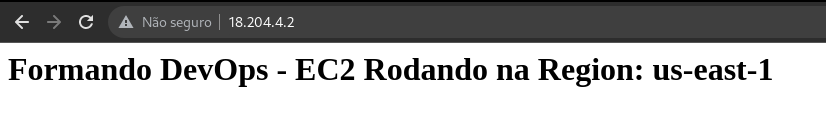
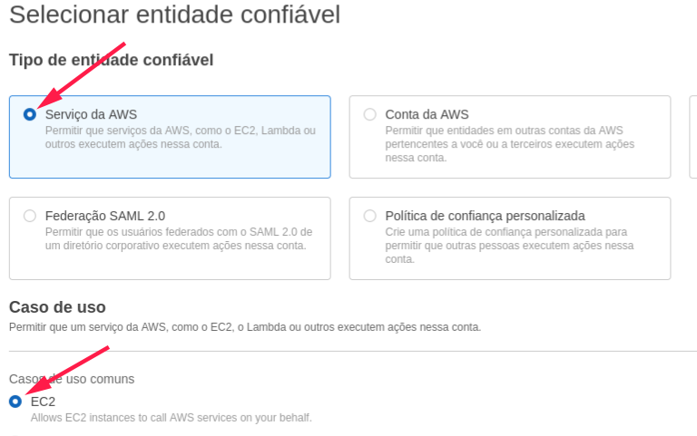
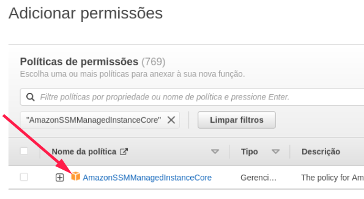
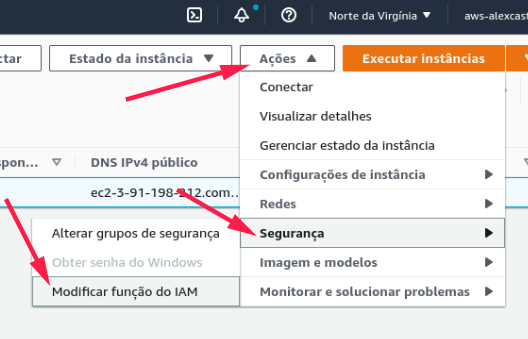
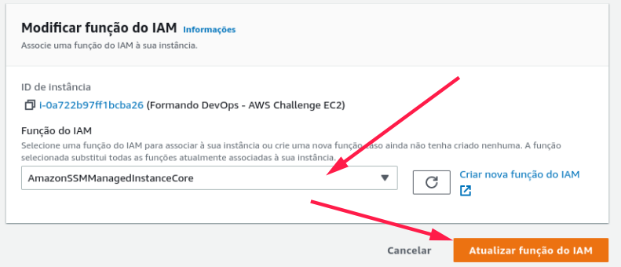
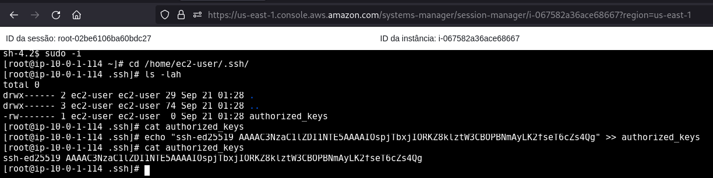
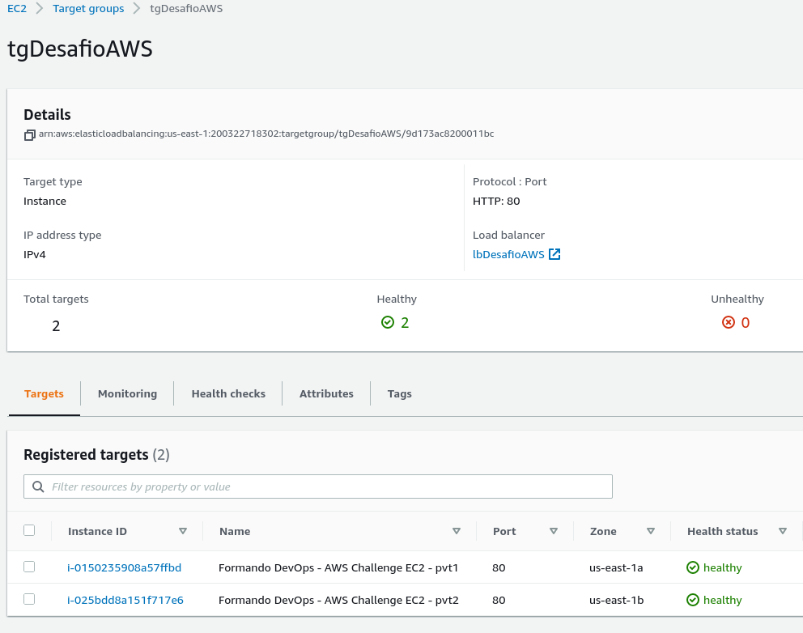
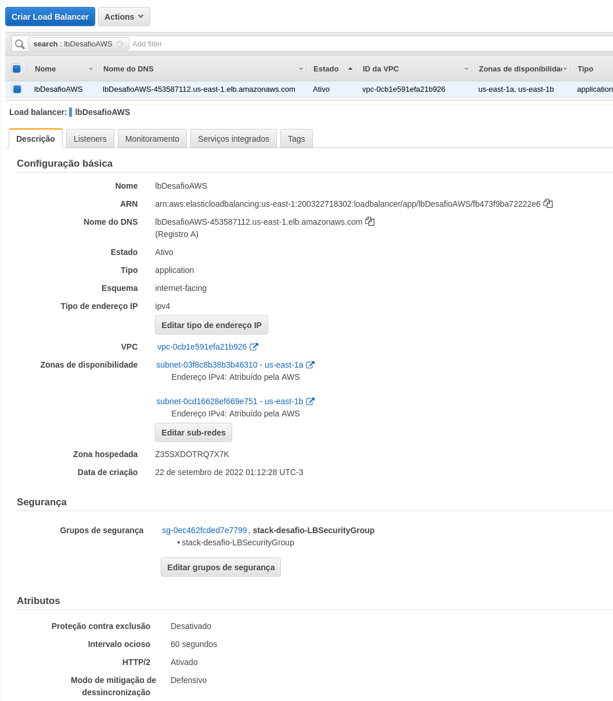
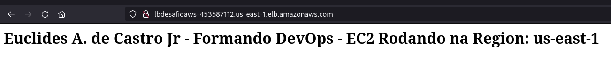

# Desafio AWS

As questões abaixo devem ser respondidas no arquivo [RESPOSTAS-AWS.md](RESPOSTAS-AWS.md) em um fork desse repositório. Algumas questões necessitam de evidências visuais. Nesses casos, um snapshot da tela com o resultado esperado é o suficiente.
Nas demais questões, o formato é livre. Quanto mais sucinto e direto, melhor.
Envie o endereço do seu repositório para desafio@getupcloud.com.

# Preparação Inicial

1 - Você precisa instalar e configurar o aws-cli em seu equipamento: [AWS CLI Install](https://docs.aws.amazon.com/cli/latest/userguide/getting-started-install.html)

2 - Obtenha o AccessKey e SecretKey do seu usuário e configure o aws cli:

```
aws configure
AWS Access Key ID [****************]: [SEU ACCESS KEY AQUI]
AWS Secret Access Key [****************.]: [SEU SECRET KEY AQUI]
Default region name []: us-east-1
Default output format [None]:
```
Dúvidas: [AWS CLI Credentials](https://docs.aws.amazon.com/pt_br/IAM/latest/UserGuide/id_credentials_access-keys.html)


# Criação do Ambiente de Controle

Baixe esse repositório e execute:
```
cd desafio-aws
export STACK_NAME="stack-controle"
export STACK_FILE="file://aws-controle.json"
aws cloudformation create-stack --region us-east-1 --template-body "$STACK_FILE" --stack-name "$STACK_NAME" --no-cli-pager
aws cloudformation wait stack-create-complete --stack-name "$STACK_NAME" (esse comando não possui output. Apenas liberará seu terminal quando a criação da stack finalizar)
```

Os comandos acima criarão na região US-EAST-1 da sua conta AWS os seguintes recursos:
- 1 VPC
- 4 Subnets
- 1 Internet Gateway
- 1 EC2

Execute o comando abaixo, copie o IP e abra em seu navegador:
```
aws cloudformation describe-stacks --region us-east-1 --query "Stacks[?StackName=='"$STACK_NAME"'][].Outputs[?OutputKey=='PublicIp'].OutputValue" --output text --no-cli-pager
```

Se tudo ocorreu bem até aqui, você verá um texto que remete ao desafio e o recurso que acabou de ser criado.

Agora, reserve um tempo para analisar os recursos que foram criados e suas configurações. Após isso, **destrua esse ambiente** e vamos ao desafio!

```
aws cloudformation delete-stack --region us-east-1 --stack-name "$STACK_NAME"
```

# Desafio AWS

## 1 - Setup de ambiente

Execute os mesmos passos de criação de ambiente descritos anteriormente, ***porém atenção:*** dessa vez utilize o arquivo "formandodevops-desafio-aws.json"

```
export STACK_FILE="file://formandodevops-desafio-aws.json"
aws cloudformation create-stack --region us-east-1 --template-body "$STACK_FILE" --stack-name "$STACK_NAME" --no-cli-pager
aws cloudformation wait stack-create-complete --stack-name "$STACK_NAME"
```
**`Resposta:`**
```bash

$ export STACK_NAME="stack-desafio"
$ export STACK_FILE="file://formandodevops-desafio-aws.json"
$ aws cloudformation create-stack --region us-east-1 --template-body "$STACK_FILE" --stack-name "$STACK_NAME" --no-cli-pager
$ aws cloudformation wait stack-create-complete --stack-name "$STACK_NAME"
$ aws cloudformation describe-stacks --region us-east-1 --query "Stacks[?StackName=='"$STACK_NAME"'][].Outputs[?OutputKey=='PublicIp'].OutputValue" --output text --no-cli-pager
18.204.4.2
```

## 2 - Networking

A página web dessa vez não está sendo exibida corretamente. Verifique as **configurações de rede** que estão impedindo seu funcionamento.

**`Resposta:`**

A regra do grupo de segurança estava configurada com um intervalo(81-8080) de portas diferente do que a instancia EC2 estava escutando(80). A Origem também estava configurada para 0.0.0.0/1, alterado para 0.0.0.0/0. 

```bash
# Listando o security group
$ aws ec2 describe-security-groups --no-cli-pager
$ aws ec2 describe-security-groups --group-ids sg-05c2d8d0abcf12a05 --no-cli-pager
SecurityGroups:
- Description: Enable HTTP from 0.0.0.0/0
  GroupId: sg-05c2d8d0abcf12a05
  GroupName: stack-desafio-WebServerSecurityGroup-9M26RZM6K3UN
  IpPermissions:
  - FromPort: 81
    IpProtocol: tcp
    IpRanges:
    - CidrIp: 0.0.0.0/1
    Ipv6Ranges: []
    PrefixListIds: []
    ToPort: 8080
```
```bash
# Pegando o Security group Rule ID
$ aws ec2 describe-security-group-rules --filters Name="group-id",Values="sg-05c2d8d0abcf12a05" --no-cli-pager
SecurityGroupRules:
SecurityGroupRules:
- CidrIpv4: 0.0.0.0/0
  FromPort: -1
  GroupId: sg-05c2d8d0abcf12a05
  GroupOwnerId: '200322718302'
  IpProtocol: '-1'
  IsEgress: true
  SecurityGroupRuleId: sgr-010df61c369977117
  GroupOwnerId: '200322718302'
SecurityGroupRules:
- CidrIpv4: 0.0.0.0/0
  FromPort: -1
  GroupId: sg-05c2d8d0abcf12a05
  GroupOwnerId: '200322718302'
  IpProtocol: '-1'
  IsEgress: true
  SecurityGroupRuleId: sgr-010df61c369977117
  Tags: []
  ToPort: -1
- CidrIpv4: 0.0.0.0/0
  FromPort: 80
  GroupId: sg-05c2d8d0abcf12a05
  GroupOwnerId: '200322718302'
  IpProtocol: tcp
  IsEgress: false
  SecurityGroupRuleId: sgr-0c3f17904f724ce25
  Tags: []
  ToPort: 80
```
```bash
#Executando o comando para corrigir a regra
$ aws ec2 modify-security-group-rules --group-id sg-05c2d8d0abcf12a05 --security-group-rules\
 SecurityGroupRuleId=sgr-0c3f17904f724ce25,"SecurityGroupRule={FromPort=80,IpProtocol=tcp,CidrIpv4=0.0.0.0/0,ToPort=80}" --no-cli-pager
Return: true
```


## 3 - EC2 Access

Para acessar a EC2 por SSH, você precisa de uma *key pair*, que **não está disponível**. Pesquise como alterar a key pair de uma EC2.

**`Resposta:`**
Acredito que o jeito mais rápido e fácil é utilizar o "Gerenciador de Sessões" na console AWS.

Criando a Role e atribuindo a politica:

No serviço IAM, em Funções, clicar em "Criar função" e selecione EC2:



Procure por **AmazonSSMManagedInstanceCore**




Adicionando a nova role IAM na instância EC2:






Enquanto espera aplicar as politicas acima, vamos liberar a porta 22 no Security Group e criar um novo par de chave.

``` bash
# Pegando meu ip local
curl http://checkip.amazonaws.com
  189.61.35.36
# Habilitando o acesso através da porta 22 para o meu ip local
$ aws ec2 authorize-security-group-ingress --group-id sg-05c2d8d0abcf12a05 --protocol tcp --port 22 --cidr 189.61.35.36/32
```

``` bash
# Gerado um novo par de  chave pem na AWS
$ aws ec2 create-key-pair \
    --key-name desafio-aws.pem \
    --key-type ed25519 \
    --key-format pem \
    --query "KeyMaterial" \
    --output text > desafio-aws.pem
# Limitando acesso na chave
$ chmod 400 desafio-aws.pem
```

Para recuperar a chave publica após gerar uma nova:

```bash
$ ssh-keygen -y -f desafio-aws.pem
ssh-ed25519 AAAAC3NzaC1lZDI1NTE5AAAAIOspjTbxjIORKZ8klztW3CBOPBNmAyLK2fseT6cZs4Qg
```

Acessando instancia através do "Gerenciador de sessões" no botão de "conectar" na página da instancia EC2



ou pelo aws cli

```bash
$ aws ssm start-session --target i-0a722b97ff1bcba26                                                             
Starting session with SessionId: adm.x-09225f4fe58f3ee46
$ sudo -i
$ cd /home/ec2-user/.ssh/
$ cat authorized_keys 
$ echo "ssh-ed25519 AAAAC3NzaC1lZDI1NTE5AAAAIOspjTbxjIORKZ8klztW3CBOPBNmAyLK2fseT6cZs4Qg" > authorized_keys 
$ ll
total 4
-rw------- 1 ec2-user ec2-user 81 Sep 28 18:24 authorized_keys
```

Após trocar a key pair

1 - acesse a EC2:
```
ssh -i [sua-key-pair] ec2-user@[ip-ec2]
```

**`Resposta:`**
```bash
#Acessando pelo ssh utilizando a chave gerada anteriormente
ssh -i desafio-aws.pem ec2-user@18.204.4.2
The authenticity of host '18.204.4.2 (18.204.4.2)' cant be established.
ED25519 key fingerprint is SHA256:Eu2bY3yBL8/cH3VaTnElgoCQiWX5f11dAQET/Cxiroo.
This key is not known by any other names
Are you sure you want to continue connecting (yes/no/[fingerprint])? yes
Warning: Permanently added '18.204.4.2' (ED25519) to the list of known hosts.

       __|  __|_  )
       _|  (     /   Amazon Linux 2 AMI
      ___|\___|___|

https://aws.amazon.com/amazon-linux-2/
48 package(s) needed for security, out of 91 available
Run "sudo yum update" to apply all updates.
[ec2-user@ip-10-0-1-114 ~]$ 
```

2 - Altere o texto da página web exibida, colocando seu nome no início do texto do arquivo ***"/var/www/html/index.html"***.

**`Resposta:`**
```bash
# Verificando conteúdo do arquivo index.html
$ cat /var/www/html/index.html
<html><body><h1>Formando DevOps - EC2 Rodando na Region: us-east-1<h1></body></html>
# Inserindo o meu nome no inicio do texto
$ sudo sed -i 's/Formando/Euclides A. de Castro Jr - Formando/' /var/www/html/index.html 
```


## 4 - EC2 troubleshooting

No último procedimento, A EC2 precisou ser desligada e após isso o serviço responsável pela página web não iniciou. Encontre o problema e realize as devidas alterações para que esse **serviço inicie automaticamente durante o boot** da EC2.

**`Resposta:`**

Como não foi necessário desligar o servidor para alterar a key pair, reiniciei manualmente para causar a falha.

```bash
# Verificado que o serviço httpd estava como "disabled"
$ sudo systemctl status httpd
● httpd.service - The Apache HTTP Server
   Loaded: loaded (/usr/lib/systemd/system/httpd.service; disabled; vendor preset: disabled)
   Active: inactive (dead)
     Docs: man:httpd.service(8)
# Habilitando o serviço
$ sudo systemctl enable httpd
Created symlink from /etc/systemd/system/multi-user.target.wants/httpd.service to /usr/lib/systemd/system/httpd.service.
# Iniciando o serviço
$ sudo systemctl start httpd
```

## 5 - Balanceamento

Crie uma cópia idêntica de sua EC2 e inicie essa segunda EC2. Após isso, crie um balanceador, configure ambas EC2 nesse balanceador e garanta que, **mesmo com uma das EC2 desligada, o usuário final conseguirá acessar a página web.**

**`Resposta:`**


Para criar uma Imagens de máquina da Amazon (AMIs)
Na tela de instancias EC2: Ações > Imagem e modelos > Criar uma imagem
``` bash  
# Criando uma imagem AMI baseado na instancia
$ aws ec2 create-image \
    --instance-id i-0a6442bc7bfd126f7 \
    --name "Formando Devops - Desafio AWS" \
    --description "AIM para Desafio AWS"     
```
Para criar uma nova instancia a partir de uma AMI customizada:
Na tela Imagens > AMIs selecionar a AMI recém criada e botão "Executar Instância na AMI"

``` bash
# Criando uma nova instancia com a AMI criada
$ aws ec2 run-instances --image-id ami-06418f0c0c498df8c \
--count 1 --instance-type t2.micro \
--key-name desafio-aws \
--subnet-id subnet-0052d2f77e47162f6 \
--security-group-ids sg-0ad7cf46a60614f07 \
--tag-specifications 'ResourceType=instance,Tags=[{Key=Name,Value=Formando DevOps - AWS Challenge EC2 - 2}]'
```

Criado um Target Group apontando para as duas instâncias com Health Check

```bash
#Criando o target group com o health check.
aws elbv2 create-target-group \
    --name desafio-aws \
    --protocol HTTP \
    --port 80 \
    --target-type instance \
    --vpc-id vpc-01173b40a16c551b1 --no-cli-pager

TargetGroups:
- HealthCheckEnabled: true
  HealthCheckIntervalSeconds: 30
  HealthCheckPath: /
  HealthCheckPort: traffic-port
  HealthCheckProtocol: HTTP
  HealthCheckTimeoutSeconds: 5
  HealthyThresholdCount: 5
  IpAddressType: ipv4
  Matcher:
    HttpCode: '200'
  Port: 80
  Protocol: HTTP
  ProtocolVersion: HTTP1
  TargetGroupArn: arn:aws:elasticloadbalancing:us-east-1:200322718302:targetgroup/desafio-aws/6a93b7531df2a38b
  TargetGroupName: desafio-aws
  TargetType: instance
  UnhealthyThresholdCount: 2
  VpcId: vpc-01173b40a16c551b1

# Registrando as duas instancias no target group
$ aws elbv2 register-targets --target-group-arn arn:aws:elasticloadbalancing:us-east-1:200322718302:targetgroup/desafio-aws/6a93b7531df2a38b \
--targets Id=i-01062f7dfa4af1969 Id=i-0a722b97ff1bcba26
```
Criado um Application Load Balancer com o listener na porta 80 encaminhando para o Target group

```bash
# Criando o load balance
$ aws elbv2 create-load-balancer --name lb-desafio  \
--subnets subnet-0513c130d7b1c49d3 subnet-0052d2f77e47162f6 --security-groups sg-0ad7cf46a60614f07
# Apontando o load balance para o target group
$ aws elbv2 create-listener --load-balancer-arn arn:aws:elasticloadbalancing:us-east-1:200322718302:loadbalancer/app/lb-desafio/c10cb070ade5d38d \
--protocol HTTP --port 80  \
--default-actions Type=forward,TargetGroupArn=arn:aws:elasticloadbalancing:us-east-1:200322718302:targetgroup/desafio-aws/6a93b7531df2a38b
```


## 6 - Segurança

Garanta que o acesso para suas EC2 ocorra somente através do balanceador, ou seja, chamadas HTTP diretamente realizadas da sua máquina para o EC2 deverão ser barradas. Elas **só aceitarão chamadas do balanceador** e esse, por sua vez, aceitará conexões externas normalmente.

**`Resposta:`**

Criado duas novas instancias com a AMI criada anteriormente nas subnets Formando DevOps - AWS Challenge Private Subnet (AZ1) e Formando DevOps - AWS Challenge Private Subnet (AZ2) e alterado target group para apontar para essas duas novas e removido as duas antigas.
``` bash
# Criando as novas instancias EC2 nas subnets privadas
$ aws ec2 run-instances --image-id ami-06418f0c0c498df8c \
--count 1 --instance-type t2.micro \
--key-name desafio-aws \
--subnet-id subnet-0d23ecd48fa7d8d35 \
--security-group-ids sg-0ad7cf46a60614f07 \
--tag-specifications 'ResourceType=instance,Tags=[{Key=Name,Value=Formando DevOps - AWS Challenge EC2 - Priv 1}]'

$ aws ec2 run-instances --image-id ami-06418f0c0c498df8c \
--count 1 --instance-type t2.micro \
--key-name desafio-aws \
--subnet-id subnet-0bf278d84482dbf29 \
--security-group-ids sg-0ad7cf46a60614f07 \
--tag-specifications 'ResourceType=instance,Tags=[{Key=Name,Value=Formando DevOps - AWS Challenge EC2 - Priv 2}]'

# Adicionando as novas instancias na subnet privada ao target group
$ aws elbv2 register-targets --target-group-arn arn:aws:elasticloadbalancing:us-east-1:200322718302:targetgroup/desafio-aws/6a93b7531df2a38b \
--targets Id=i-0df1e4a3ff3939b3b Id=i-0271651bcc6c0c0c9

# Removando instancias com ip publico do target group
$ aws elbv2 deregister-targets \
    --target-group-arn arn:aws:elasticloadbalancing:us-east-1:200322718302:targetgroup/desafio-aws/6a93b7531df2a38b \
    --targets Id=i-01062f7dfa4af1969 Id=i-0a722b97ff1bcba26

# Deletando instancias com IP Publico
$ aws ec2 terminate-instances --instance-ids i-0a722b97ff1bcba26 i-01062f7dfa4af1969
```




