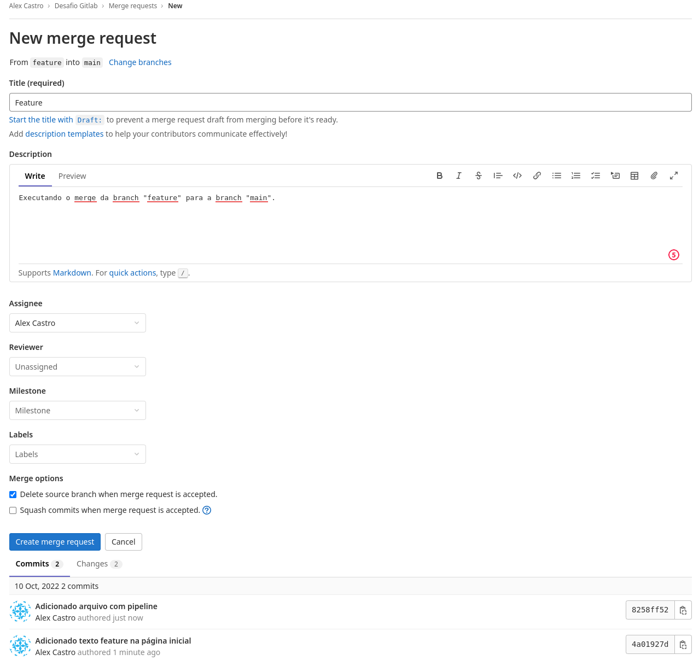
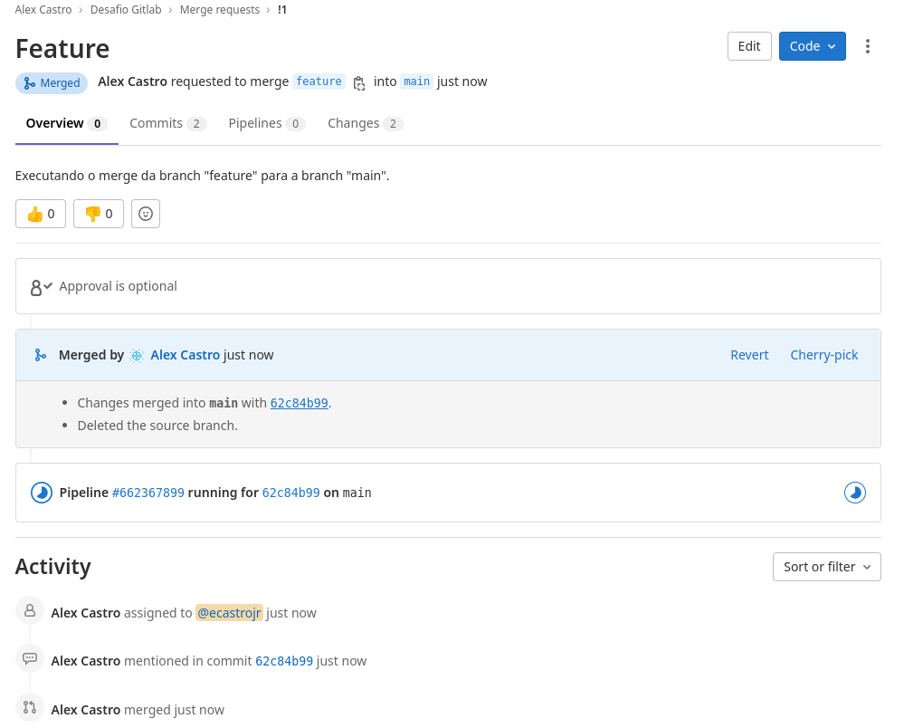
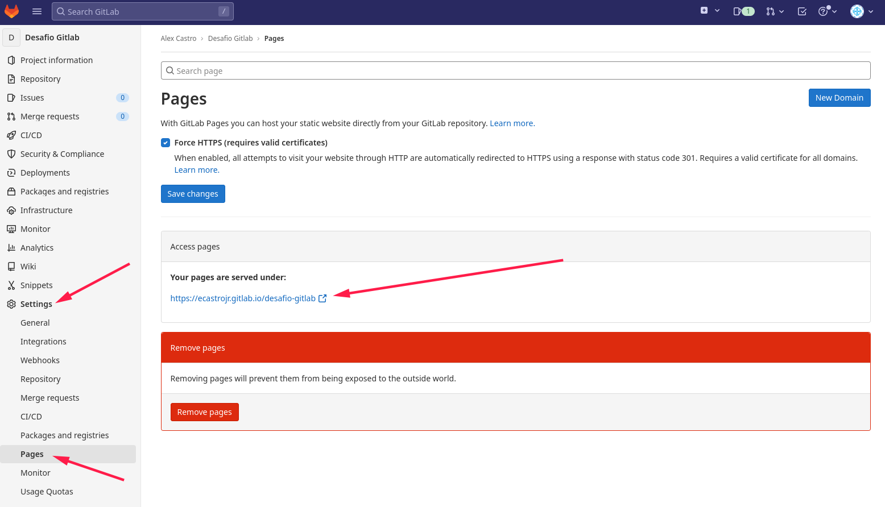

# Desafio GitLab

As questões abaixo devem ser respondidas no arquivo [RESPOSTAS.md](RESPOSTAS.md) em um fork desse repositório. Algumas questões necessitam de evidências visuais. Nesses casos, um screenshot da tela com o resultado esperado é o suficiente.
Nas demais questões, o formato é livre. Quanto mais sucinto e direto, melhor.
Envie o endereço do seu repositório para desafio@getupcloud.com.

# Explicação
#### 1. O que é o GitLab Pages?
O GitLab Pages é um serviço de hospedagem de páginas estáticas, que permite que você hospede seu site, blog ou documentação diretamente do seu repositório GitLab. Ele é gratuito e de código aberto, e pode ser usado com qualquer repositório GitLab, público ou privado.

#### 2. Você fará o deploy de um site estático no GitLab Pages.

1. Crie uma conta no Gitlab: [Gitlab](https://gitlab.com/users/sign_in)

2. Crie um repositório público chamado "desafio-gitlab" e clone-o em seu computador.

*`Resposta:`*

[https://gitlab.com/ecastrojr/desafio-gitlab](https://gitlab.com/ecastrojr/desafio-gitlab)

```bash
$ git config --global user.name "Alex Castro"
$ git config --global user.email "github@alexcastro.net.br"
$ git clone git@gitlab.com:ecastrojr/desafio-gitlab.git
Cloning into 'desafio-gitlab'...
warning: You appear to have cloned an empty repository.
cd desafio-gitlab
$ git switch -c main
Switched to a new branch 'main'
```

3. Adicione os arquivos do desafio ao seu repositório local e faça o primeiro commit.

*`Resposta:`*

```bash
$ cp -r ../formando-devops/desafio-gitlab/* .
$ git status
On branch main

No commits yet

Untracked files:
  (use "git add <file>..." to include in what will be committed)
	.DS_Store
	README.md
	public/

nothing added to commit but untracked files present (use "git add" to track)
$ git add .
$ git commit -m "Adicionando os arquivos do desafio"
[main (root-commit) 088b117] Adicionando os arquivos do desafio
 4 files changed, 51 insertions(+)
 create mode 100644 .DS_Store
 create mode 100644 README.md
 create mode 100644 public/css/style.css
 create mode 100644 public/index.html

```

4. Faça o push do seu repositório local para o repositório remoto.

*`Resposta:`*

```bash
$ git push -u origin main
Enumerating objects: 8, done.
Counting objects: 100% (8/8), done.
Delta compression using up to 12 threads
Compressing objects: 100% (7/7), done.
Writing objects: 100% (8/8), 1.69 KiB | 1.69 MiB/s, done.
Total 8 (delta 0), reused 0 (delta 0), pack-reused 0
To gitlab.com:ecastrojr/desafio-gitlab.git
 * [new branch]      main -> main
branch 'main' set up to track 'origin/main'.
```

5. Mude o texto da página inicial para "Desafio GitLab - Dev".

*`Resposta:`*

```bash
$ cat public/index.html
<html>
  <head>
    <meta charset="utf-8">
    <title>Desafio Gitlab</title>
    <link rel="stylesheet" href="css/style.css">
  </head>
  <body>
    <div class="centralized">
      <h1>Desafio Gitlab - DEV</h1>
    </div>
  </body>
</html>

```

6. Crie uma nova branch chamada "feature" e altere o texto da página inicial para "Desafio GitLab - Feature".

*`Resposta:`*

```bash
$ git checkout -b feature
Switched to a new branch 'feature'
$ cat public/index.html
<html>
  <head>
    <meta charset="utf-8">
    <title>Desafio Gitlab</title>
    <link rel="stylesheet" href="css/style.css">
  </head>
  <body>
    <div class="centralized">
      <h1>Desafio Gitlab - Feature</h1>
    </div>
  </body>
</html>
$ git add public/index.html
$ git commit -m "Adicionado texto feature na página inicial" public/index.html
[feature 4a01927] Adicionado texto feature na página inicial
 1 file changed, 2 insertions(+), 2 deletions(-)
```

7. Crie um pipeline no GitLab CI para fazer o deploy do site estático no GitLab Pages.

*`Resposta:`*

```bash
$ cat .gitlab-ci.yml
```
```yaml
image: alpine:latest

pages:
  stage: deploy
  script:
  - echo 'Executando...'
  artifacts:
    paths:
    - public
  only:
  - main
```

8. Faça o merge da branch "feature" para a branch "main".

*`Resposta:`*

```bash
$ git add .gitlab-ci.yml
$ git commit -m "Adicionado arquivo com pipeline" .gitlab-ci.yml
[feature 8258ff5] Adicionado arquivo com pipeline
 1 file changed, 11 insertions(+)
 create mode 100644 .gitlab-ci.yml
$ git push origin feature
Enumerating objects: 10, done.
Counting objects: 100% (10/10), done.
Delta compression using up to 12 threads
Compressing objects: 100% (7/7), done.
Writing objects: 100% (7/7), 796 bytes | 796.00 KiB/s, done.
Total 7 (delta 2), reused 0 (delta 0), pack-reused 0
remote: 
remote: To create a merge request for feature, visit:
remote:   https://gitlab.com/ecastrojr/desafio-gitlab/-/merge_requests/new?merge_request%5Bsource_branch%5D=feature
remote: 
To gitlab.com:ecastrojr/desafio-gitlab.git
 * [new branch]      feature -> feature
```





9. Encontre o endereço do seu site no GitLab.

*`Resposta:`*



10. Acesse a página inicial do seu projeto no Gitlab e verifique se o texto foi alterado.

*`Resposta:`*


11. Adicione no arquivo [RESPOSTAS.md](RESPOSTAS.md) o link para o seu repositório e o log do git com o histórico de commits. Envie também um screenshot da Gitlab Page criada.

*`Resposta:`*

Link: [https://gitlab.com/ecastrojr/desafio-gitlab](https://gitlab.com/ecastrojr/desafio-gitlab)

Log: 
```bash
*   commit 62c84b991244debc98459fb16df660c2d9fc8775 (HEAD -> feature, origin/main)
|\  Merge: 088b117 8258ff5
| | Author: Alex Castro <github@alexcastro.net.br>
| | Date:   Mon Oct 10 04:31:53 2022 +0000
| | 
| |     Merge branch 'feature' into 'main'
| |     
| |     Feature
| |     
| |     See merge request ecastrojr/desafio-gitlab!1
| | 
| * commit 8258ff52bbce0880fe8c52caf71e99d803fb732d (origin/feature)
| | Author: Alex Castro <github@alexcastro.net.br>
| | Date:   Mon Oct 10 01:28:38 2022 -0300
| | 
| |     Adicionado arquivo com pipeline
| | 
| * commit 4a01927deb5efd32bdf3fea02e1bf78f24639b12
|/  Author: Alex Castro <github@alexcastro.net.br>
|   Date:   Mon Oct 10 01:27:35 2022 -0300
|   
|       Adicionado texto feature na página inicial
| 
* commit 088b1171554fe46d1ddc6f38ba944c06874da88d (main)
  Author: Alex Castro <github@alexcastro.net.br>
  Date:   Mon Oct 10 00:55:27 2022 -0300
  
      Adicionando os arquivos do desafio
```